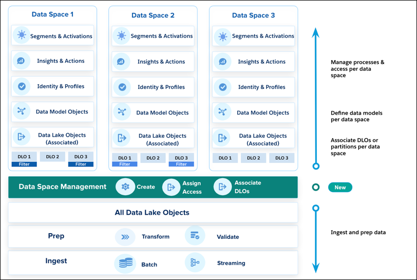

 

<h1 align='center'>Salesforce Data Cloud</h1>

---

## Data 360 Platform Summary

This table summarizes the four core stages of data management within Data 360, from ingestion to action.

| Stage | Core Function | Key Components & Capabilities |
| :--- | :--- | :--- |
| **1. Prepare, Connect, & Ingest** | Bringing data into the platform and initial storage. | -> **Connectors:** 270+ (including Salesforce, APIs, MuleSoft). -> **Storage:** **DLOs** (original schema) mapped to **DMOs** (**C360 Data Model** schema).  -> **Unstructured Data:** **UDLOs** processed for **vector database** storage (chunking, embedding). -> **Zero Copy:** Data federation (read-only access). |
| **2. Harmonize & Unify** | Creating a single, gold-standard view of the customer.  |  -> **Data Model:** Pre-loaded **C360 Data Model** (300+ objects).  -> **Identity Resolution:** **Match Rules** (fuzzy, exact) + **Reconciliation Rules** = **Unified Profile**.  -> **Mechanism:** Creation of **Link Tables** to tie all original records to the unified profile. |
| **3. Segment, Analyze, & Predict** | Generating customer insights and forecasting behavior. |  -> **Segmentation:** Generative (natural language), Waterfall, Nested.  -> **Insights:** Calculated (e.g., LTV), created via batch or streaming.  -> **Einstein Studio:** ML/AI playground, supports **Bring-Your-Own-Model (BYOM)** for predictions.  -> **Reporting:** BI tool connection (Tableau, Power BI) via JDBC driver. |
| **4. Query & Act** | Accessing unified data and leveraging it in business workflows. |  -> **Query:** SOQL, SQL, vector/hybrid search.  -> **Actions:** Agents (digital labor), Flows, API calls, Webhooks.  -> **Activations:** Sending segments to external platforms (Marketing Cloud, ad platforms) for orchestration.  -> **Data Shares:** Sharing derived data **without copying** (completing the feedback loop). |

---

## Data Model

| Object | Abbreviation | Definition | Creation and Usage |
| :--- | :--- | :--- | :--- |
| **Data Lake Object** | DLO | A container for the **structured data** brought into Data Cloud. | Automatically created from data streams, but can also be created manually. A DLO is **mapped to a DMO**. |
| **Unstructured Data Lake Object** | UDLO | A container for **unstructured data** (e.g., documents, media files) referenced by Data Cloud. | Created manually. A UDLO is **automatically mapped to an existing or new UDMO**. |
| **Data Model Object** | DMO | A **harmonized grouping of structured data** created from data streams, insights, and other sources. It represents the standardized Customer 360 data model. | A DLO is **mapped to a DMO** to ensure consistency and standardization. |
| **Unstructured Data Model Object**| UDMO | A group of **unstructured data** created from an unstructured data source. | A UDLO is **automatically mapped** to an existing or new UDMO. |
| **External Data Lake Object** | External DLO | A storage container with **metadata** for data **federated** (referenced, not copied) from an **external data source** (e.g., Snowflake, AWS S3). | Acts as a **reference**, pointing to the data physically stored in an external source. |

### References

- [Standard DMO List](https://developer.salesforce.com/docs/data/data-cloud-dmo-mapping/guide/c360dm-datamodelobjects.html)

- [Customer 360 Data Model](https://trailhead.salesforce.com/content/learn/modules/customer-360-data-model-for-customer-data-platform?_ga=2.10926012.949451092.1763453583-1648456276.1757054449)

---

## Data Mapping (DLO to DMO)

Mapping Data from `Contact` (Data Lake Object) to `Employee` (Data Model Object). 

### 1. Create Data Stream (Source Connection) 🔗

- In Data Cloud, go to `Data Streams` $\to$ New.
- Select `Salesforce CRM` from Connected Sources.
- Click on `View Objects` $\to$ Select `Contact` Object.
- Object Category $\to$ `Other`.
- Select the required fields: `Contact ID, FirstName, LastName, Email`.
- Click Next and then click Deploy.
- Data Lake Object will be created automatically.

### 2. Create Data Model Object

- Go to Data Model Objects in Data Cloud $\to$ Click New
- Add Fields: `Associate ID (Primary Key), First Name, Last Name, Email`.
- Save and Activate DMO.

### 3. Map Contact (DLO) to Associate (DMO)

- Go to `Data Streams` $\to$ Open the `Contact` Data Stream.
- In data map section click on `Start`.
- Click on `Select Objects` in data model object section $\to$ Select `Associate` Object.
- Map the fields from DLO to DMO.
- Click Save and close.

| Source DLO Field (Contact_Home) | Target DMO Field (Associate) |
|---|---|
**Contact ID** |	Map to **Associate ID**
**FirstName** |	Map to **First Name**
**LastName** |	Map to **Last Name**
**Email** |	Map to Work **Email**

---

## Data Space

### References

- [Data Space](https://salesforcedatacloud.hubs.vidyard.com/watch/EfZ47u81CogN9N6LSabeQq)

---
